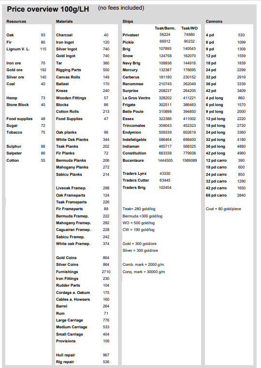
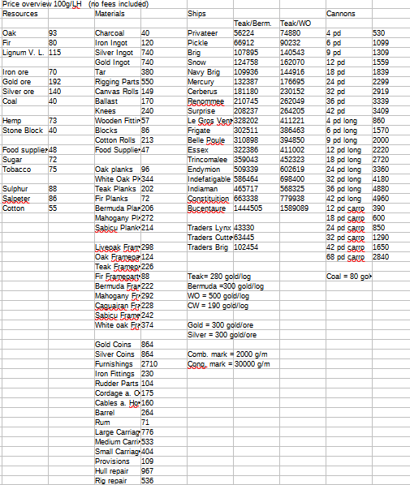

# Extraction of pdf tables

## Objective

Most well-known Python modules to extract information from pdf files need a bit of reworking. This piece of code is based on [Pdfminer.six] and it is aimed at extracting tables from pdfs taking into account the position of each pdf bounding box in the page. Images are excluded.

## Example

[Pdfminer.six]:https://pdfminersix.readthedocs.io/en/latest/#

